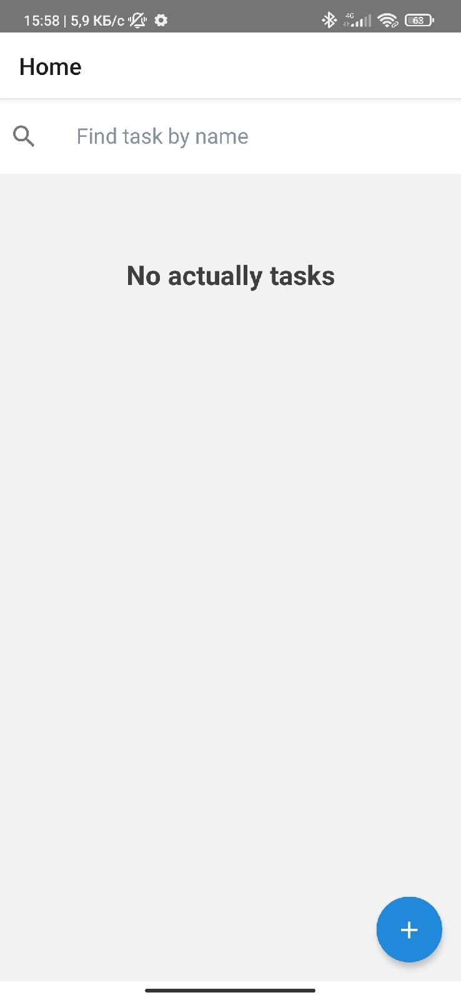
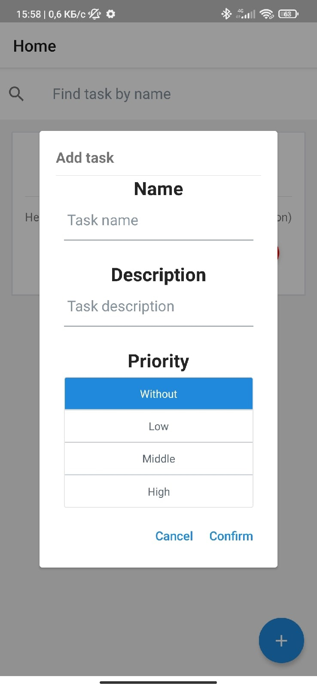
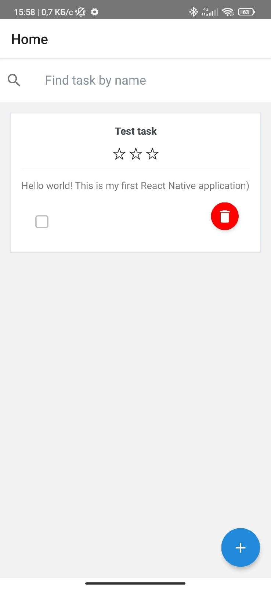
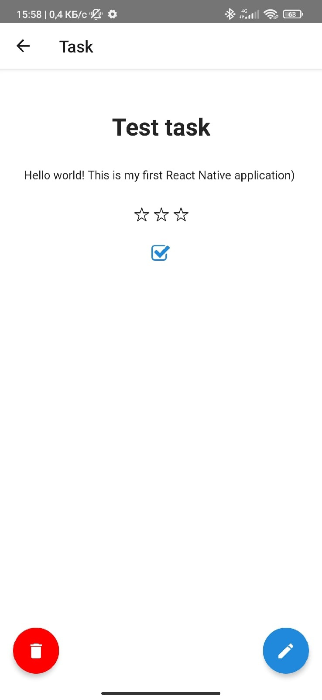
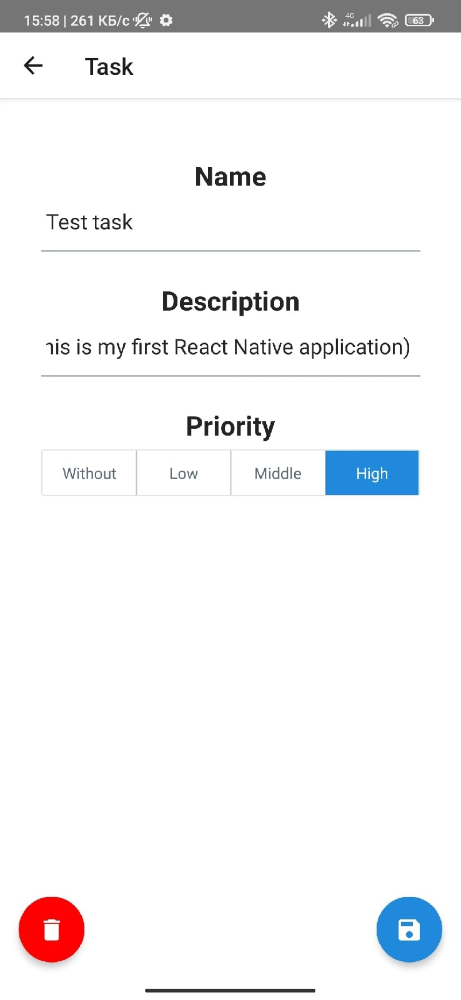

# ToDo application

## Table of contents

- [Overview](#overview)
    - [Technical specification](#technical-specification)
    - [Screenshots](#screenshots)
- [Built with](#built-with)
- [Author](#author)

## Overview

### Technical specification

Create ToDo application:

Application must contain:
- Task list
  - View
  - Find
  - Create
- Task screen
  - View
  - Edit
  - Delete

The task consist of: 
- name
- description
- priority
- is done

ToDo App must use offline storage.

### Screenshots

## Built with

- [React Native CLI](https://reactnative.dev/)
- [React Navigation](https://reactnavigation.org/)
- [TypeScript](https://www.typescriptlang.org/)
- [MobX](https://mobx.js.org/)

## Author

- Telegram - [@Keberson](https://www.t.me/Keberson)
